# **_Games Chart - Project Portfolio 3_**

## [View app](https://games-chart.herokuapp.com/)

# Contents

# Objective

* The application lets the user add games to a spreadsheet. The information required for each record is the games title, genre and the platform the game is available for. 
* Another function allows users to vote for any of the games on the list. The number of votes will be recorded on the spreadsheet. 
* The final function allows users to query the spreadsheet. Users can view the top ten games on the spreadsheet based on the number of votes alone. A search by genre or platform can also be performed with the results still being organised by the number of votes. Therefore it's always a top ten chart that's being viewed, but could be the top ten adventure games or the top ten Nintendo Switch games. With a large number of games being in the list, these searches will allow users to glean further insight from the data.

# User Experience (UX)

## Design Diagram
* Initially at the beginning of the program I wanted to give the users direct access to each of the 3 functions; add game, vote for a game or search the games list. 
* My mentor suggested that this would not be ideal for the user experience as the program would need to be restarted if they wanted to run another function. 
* The alternative was to ask the user if they wanted to use each of the functions in turn, where they were given the option to choose 'Yes' or 'No'. The user would then have the opportunity to use one of more function in one run of the program.
* There was additional functionality I wanted to include for the search function. This would have allowed the user to save their search results to a file. Given the overall functionality of my program, I was advised this operation was not needed.

 

<b>Design Diagram</b>

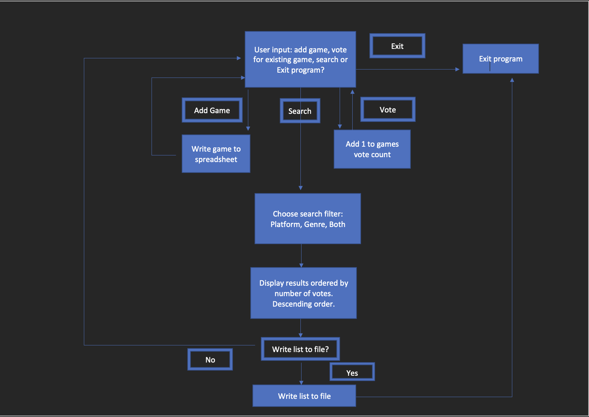

 

## Features
### Introduction
When the program begins, a welcome message is printed and the user is asked if they want to add a game to the list.

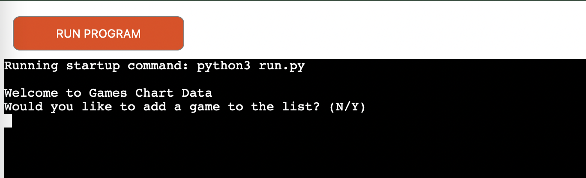 

### Add Game
If the user chooses to add a game then they are asked to enter the 3 parts of data one at a time. The title, genre, then platform. The user's entered data is printed followed by messages confirming the data is valid and has been uploaded successfully.
 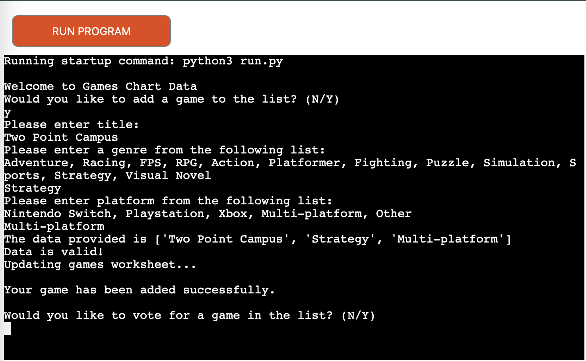 
Updated spreadsheet
 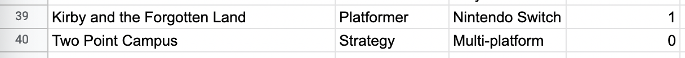 
If an incorrect genre or platform are entered, an error message will be displayed and the user will be prompted to enter the data again.
  
 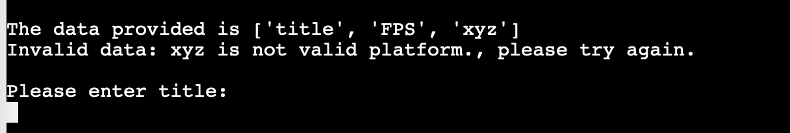 

### Vote Game
When a user votes for a game, 1 is added to the current number of votes. If the game is not found in the spreadsheet then an error is returned and the user is asked to enter another game.
 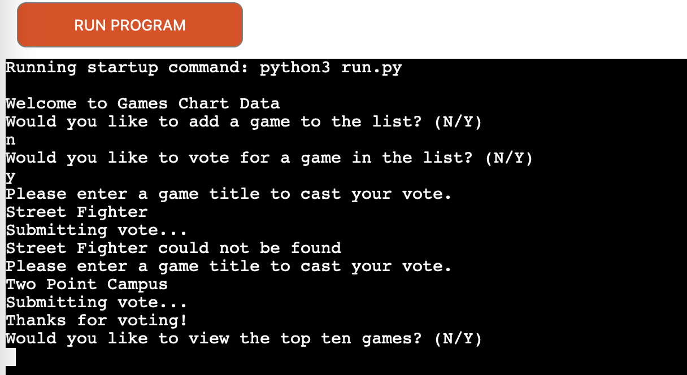 
Updated spreadsheet.
 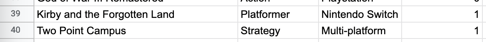 

### Search Spreadsheet
The user can choose to display the top ten games from the list based on votes alone, or filter by genre or platform.
Validation is also in place to ensure correct genre and platforms are entered.
 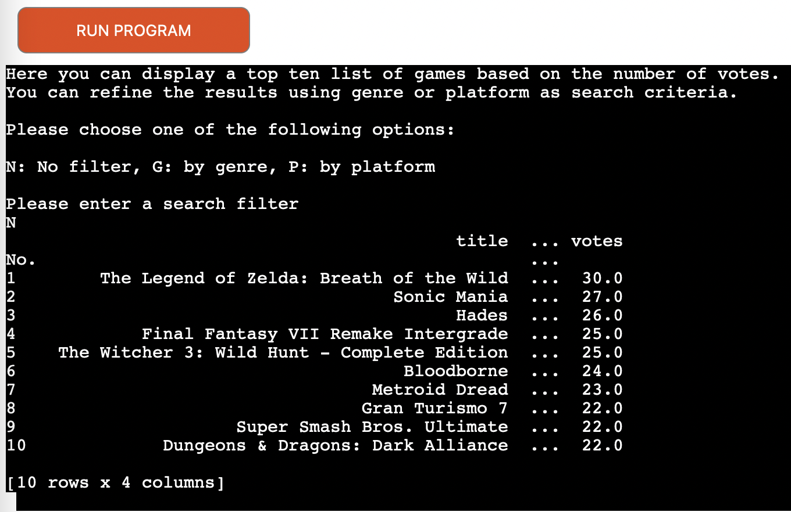 
Filtered by genre.
 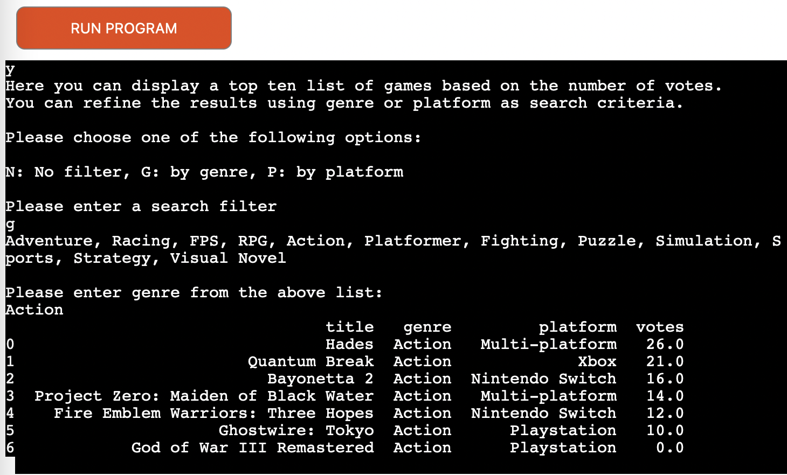 
Filtered by platform.
 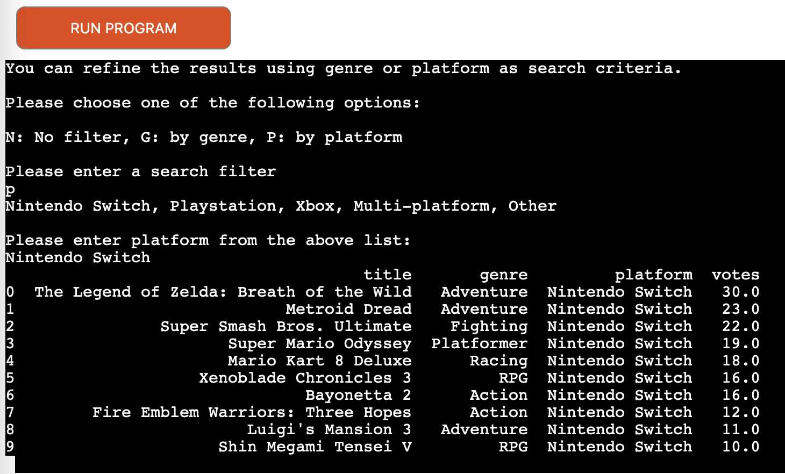 

## Future Features

* Multi-platform games may not be available on all consoles, they may only be available for 2. Searching for a console like Xbox, will only return games that are exclusive for that console. Multi-plaform games that are also on Xbox will not be returned. A future improvement would be to replace multi-platform with a comma separated list of consoles e.g. Xbox, Playstation. All Xbox games would then be returned in the results whether they are exlusive or on other consoles as well.

* On sites like Nintendo Life and Pure Xbox all games have 2 genres. This is reasonable as advanced as games are, 2 genres do a better job of summming a game up. This could result in more accurate searches that users would expect or return the same games in too many searches, making the genre search less effective.

* Adding a function to Export the top ten lists to a file to allow users to use the data for their own purposes.

# Technologies Used
* [Python](https://python.org)
* [Google Sheets](https://docs.google.com/spreadsheets)
* [HTML5](https://en.wikipedia.org/wiki/HTML5) - Used in Code Institute template.
* [CSS](https://en.wikipedia.org/wiki/CSS) - Used in Code Institute template.
* [JavaScript](https://en.wikipedia.org/wiki/JavaScript) - Used in Code Institute template.

# External Sources
* [Pandas docs](https://pandas.pydata.org/)
* [gspread docs](https://docs.gspread.org/)
* [gspread-dataframe docs](https://pypi.org/project/gspread-dataframe/)
* [Google Sheets](https://docs.google.com/spreadsheets)
* [W3 Schools](https://www.w3schools.com/)
* [Stack Overflow](https://stackoverflow.com/)
* CI Love Sandwiches walkthrough project

# Python Libraries used
* [Pandas docs](https://pandas.pydata.org/)
* [gspread docs](https://docs.gspread.org/)
* [gspread-dataframe docs](https://pypi.org/project/gspread-dataframe/)
* [google.oauth2.service_account](https://google-auth.readthedocs.io/en/master/reference/google.oauth2.service_account.html)

# Testing
My code was validated using [PEP8](http://pep8online.com/).
 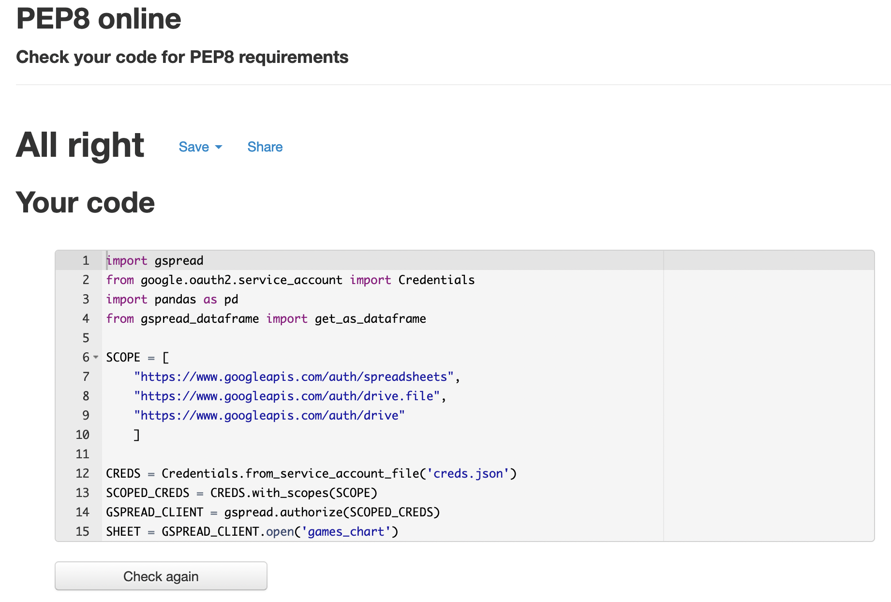 

## Bugs and solutions
* Adding 1 to the vote cell when a game receives a vote.
 Received invalid type error.
 I added the following code to the update_worksheet function to set the vote cell to 0 by default.
 data.append(0)
 The data list then became \[title, genre, plaform, 0], placing the 0 in the vote column.
 I then wrapped vote cell variable in the int method in the following line:
 games.update_cell(game_cell.row, 4, int(vote) + 1)
 
 
* Adding a chart postition column to the top ten dataframe.
 The column displays 1 to 10 in ascending order along side the list of games.
 I used the set_index method to acheive this. I appended this to the top_ten dataframe on the print statement that displayed the list.
 The chart number list was applied before the games were re-ordered according to the number of votes. The chart positions were in the wrong order.
 I used the set_index method on the top_ten dataframe before the print statement and the chart positions appeared in the correct order.
 
 
* Data validation for adding a new game.
 If genre, title or platform were entered with a leading space then they would not be recognized as valid input. E.g. title, genre, platform. I was asking the user to input all three items in one comma separated string.
 I used the strip method to remove leading or trailing spaces.
 I updated the program later to ask the user for one item at a time which reduces the likelyhood of an unwanted space being entered. However, I left the strip method in place.
 
 
* Search by genre and platform validation.
 The user was prompted to enter the value again, even if the genre or platform was correct.
 When the genre or plaform was correct the list would be printed and the user still asked to enter another value.
 The program would end without print the filtered list.
 These issues were cause by certain parts of code being within or outsite of the while loop. In addition to this, the continue and break keywords were also misplaced or misused.
 I looked at examples of break and continue for content validaton on Stack Overflow.
 
 
* I tested each function as they were added to confirm the basic functionality was working. I then added the validation checks to enforce correct data input.

# Deployment
### GitHub
The website was deployed by the following steps:
* From the GitHub repository page, click settings.
* Click pages and under source select the main branch from the dropdown and then click save.
* The site will then be published with the URL provided. 

To clone a GitHub repository, use the following steps:
* Navigate to the respository main page.
* Above the list of files click Code.
* Copy the URL for the repository.
* You'll be presented with different method of cloning the repository.
* Using HTTPS, an SSH key, or using GitHub CLI.
* Open Terminal and change working directory to the location where you want the cloned directory.
* Type git clone, and then paste the URL you copied earlier.
* Press enter to create your local clone.

### Heroku
* Create new account and click 'Create new app'.
* Once the app is created, under settings, click 'Config Vars'.
* Add the contents of the Google Sheets credentials file.
* Add additional config var: PORT with a value of 8000.
* Add two build packs for Python and Nodejs.
* Click the Deploy tab and choose GitHub as deployment method.
* Enter the GitHub project repository and click connect.
* Scroll down and click 'Deploy Branch' to get the latest version of the repository code.
* Click on 'View' to access the deployed app.

# Credits
Thank you to my mentor Adegbenga for advising me on the best course of implementation for my project to meet the necessary requirements and for other pointers.
The Code Institute Love Sandwiches project was referenced for the implentation of my code.

